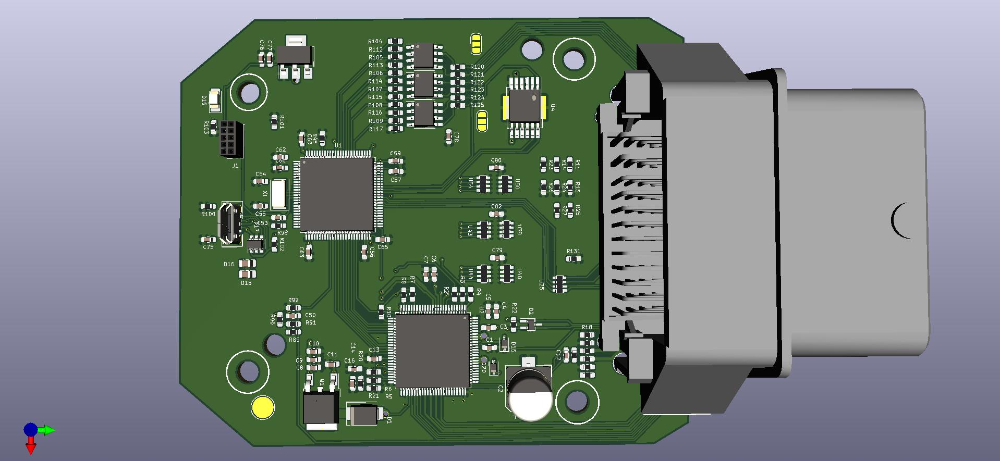
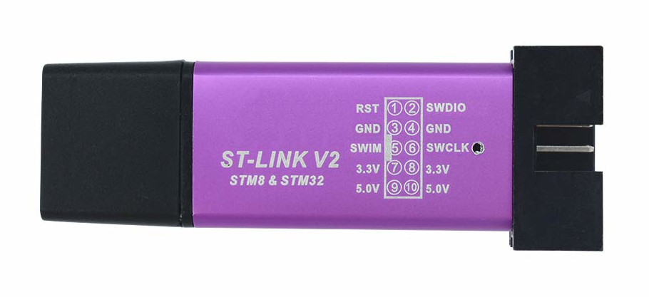

# Forked from https://github.com/rusefi/hw_microRusEfi
Main change was made, is add microSD card slot and prepare for MRE Add-on Board.

See [changelog.txt](https://github.com/JRDMcLAREN/hw_microRusEfi/blob/master/changelog.txt) for more details.
Issue: SD card slot must be shifted upwards. It doesn not fit into the ALU Case without case cover modification. - WIP

# microRusEFI

microRusEFI is a small & cheap engine management system board designed for fully sequential 1, 2, 3 and 4 cylinder applications.

6 and 8 cylinders are possible with some limitations. 5 cylinder application not recommended. You would need at least two microRusEFI units to run a v12.

microRusEFI uses a waterproof connector and its aluminum enclosure could be sealed. 

microRusEFI hardware runs [rusEFI firmware](https://github.com/rusefi/rusefi).

microRusEfi supports dual Hall shaft position sensor input or 1xHall + 1xVR shaft position sensor input
(A few resistors must be replaced on the PCB in order to switch from one setup to another)

Open source design available in this repository,
or available as a kit or completely assembled from https://www.ebay.com/itm/333532119947

# Capabilities
* Primary VR or Hall input (configurable with few resistor changes)
* Secondary Hall input
* x4 analog thermistor (temperature) inputs
* x10 analog voltage inputs (0-5v)
* x4 high-Z injector outputs
* x2 high-current low side outputs for IAC/VVT/other solenoids
* Dedicated main relay control output 
* x4 low-current low side outputs for relays or warning lights 
* x4 5v logic-level ignition outputs
* x2 5v/12v configurable logic level outputs (requires resistor changes)
* Electronic throttle body (drive by wire)
* CAN connectivity on the plug
* USB connectivity on the plug 
* SPI and TTL available on PCB
* stepper IAC support (beta testing please report your results!)

# Documentation

[Connector Pinout](https://github.com/rusefi/rusefi/wiki/Hardware-microRusEfi-wiring)

[microRusEFI documentation wiki](https://github.com/rusefi/rusefi/wiki/Hardware-microRusEfi)

[microRusEFI kit instructions](https://github.com/rusefi/rusefi/wiki/Hardware-microRusEfi-kit-instructions)

[microRusEFI forum thread](https://rusefi.com/forum/viewtopic.php?f=4&t=1538)

[asembled images & assembly files](gerbers)

[ChangeLog](releaseNotes.md)

If you download complete repo do not forget to download libraries. If you git clone be sure to also

`git submodule update --init`

Do you like what you see here? Maybe https://www.patreon.com/rusefi

## BOM highlights

stm32f767

[TLE8888-2QK](https://www.infineon.com/dgdl/Infineon-Infineon-TLE8888QK-DS-v01_02-EN.pdf?fileId=5546d4624f205c9a014f402ebd1c6095)

[Final assembly BOM notes](https://github.com/rusefi/hw_microRusEfi/blob/master/gerbers/rusEFI-Micro_R0.4.x-not-pre-assembled.md)

[48 pin connector](https://github.com/rusefi/rusefi/wiki/Hardware-microRusEfi-connectors)

iBom https://rusefi.com/docs/ibom/microRusEfi_latest.html

## Adapter Boards

microRusEFI could be used as a brain for Plug&Play vehicle specific adapter boards

1) https://github.com/rusefi/hw_55_te For Yanvar/Micas case

## Case

Model CKKB48-1-A (Weigh 200g)

[Case 3D Model](https://cad.onshape.com/documents/cce953328a88b521d5673ac5/w/e2d3a78cfb432482f5aac9ea/e/2eb39a31ab72390c6384f68c)

Cover bolts M3.5x0.6

PCB bolts M3 0.5mm thread, L=7.5mm https://www.mcmaster.com/94209A619/

## Gerbers

[Gerbers and pictures of fabricated boards](gerbers)

## ST-LINK

Unfortunately eBay has a few different version of cheap ST-LINK V2 devices with different pinout. Here is the pinout rusEfi is compatible with:

